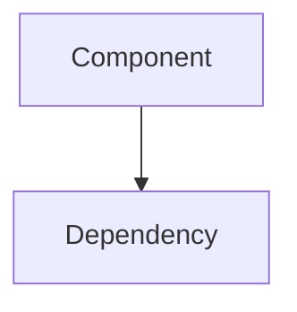

# /scw:design - Architecture Design Workflow

> **Standalone Design**: Create architecture design with code reuse analysis. Use when design is needed without full spec workflow.

## Triggers
- Designing component architecture
- Planning refactoring approach
- Creating system integration designs
- Evaluating technical approaches

## Usage
```
/scw:design [feature-or-component] [--scope component|module|system] [--format mermaid|text]
```

**Parameters:**
- `feature-or-component`: What to design
- `--scope`: Design scope (default: component)
- `--format`: Diagram format (default: mermaid)

## Behavioral Flow

### Phase 1: Context Loading
1. **Load Steering Documents**: tech.md, structure.md
2. **Activate Agents**: system-architect, domain agents
3. **Understand Scope**: What needs to be designed?
4. **Identify Constraints**: Technical and business limits

### Phase 2: Codebase Analysis
1. **Search Existing Code**: Find related components
2. **[GEMINI DELEGATION]**: If >10 files to analyze
3. **Identify Reuse Opportunities**: What exists that can be leveraged?
4. **Map Dependencies**: What does this connect to?

### Phase 3: Design Creation
1. **Architecture Decisions**: Document key choices
2. **Component Design**: Define interfaces and responsibilities
3. **Data Flow**: How data moves through the system
4. **Integration Points**: How it connects to existing code

### Phase 4: Validation
1. **PM Agent**: SelfCheckProtocol on design quality
2. **Present Options**: If multiple approaches viable
3. **Document Trade-offs**: Pros/cons of choices
4. **Output Design**: Generate design document

Key behaviors:
- **Leverage Existing**: Find and use what already exists
- **Follow Patterns**: Align with tech.md conventions
- **Consider Constraints**: Stay within project boundaries
- **Document Decisions**: Record why, not just what

## MCP Integration
- **Sequential MCP**: Step-by-step design reasoning
- **Serena MCP**: Cross-session design context
- **Context7 MCP**: Framework-specific patterns
- **Tavily MCP**: Research best practices

## Tool Coordination
- **Glob/Grep**: Search for existing patterns
- **Read**: Analyze existing code
- **TodoWrite**: Track design decisions
- **Write**: Generate design document

## Key Patterns
- **Component Interface First**: Define contracts before implementation
- **Code Reuse Analysis**: Always check what exists
- **Trade-off Documentation**: Record pros/cons of decisions
- **Mermaid Diagrams**: Visual architecture representation

## Examples

### Component Design
```
/scw:design authentication-service --scope component
# Analyzes existing auth patterns
# Designs new auth service with interface
# Creates Mermaid component diagram
```

### Module Architecture
```
/scw:design payment-gateway --scope module
# Reviews payment-related code
# Designs module architecture
# Defines integration points
```

### System Integration
```
/scw:design third-party-analytics --scope system
# Analyzes system boundaries
# Designs integration approach
# Documents data flow
```

## Boundaries

**Will:**
- Create architectural designs with diagrams
- Analyze codebase for reuse opportunities
- Document design decisions and trade-offs
- Follow steering document conventions
- Delegate large codebase analysis to Gemini

**Will Not:**
- Implement the design (use /scw:implement)
- Create full specifications (use /scw:spec-create)
- Skip codebase analysis
- Make decisions without documenting rationale

## Output Format

```markdown
# Design: {component-name}

## Overview
{High-level description}

## Architecture Diagram


## Code Reuse Analysis
| Existing Component | How to Leverage |
|-------------------|-----------------|
| {component} | {usage} |

## Design Decisions
| Decision | Options | Choice | Rationale |
|----------|---------|--------|-----------|
| {decision} | {options} | {choice} | {why} |

## Component Interfaces
```typescript
interface IComponent {
  // Interface definition
}
```

## Data Flow
{Description of how data moves}

## Integration Points
{How this connects to existing code}
```

## PM Agent Integration

```
Design Validation:
  SelfCheckProtocol:
  - Does design follow tech.md patterns?
  - Is code reuse maximized?
  - Are interfaces clearly defined?
  - Are trade-offs documented?
  - Are integration points identified?
```

## Gemini Delegation

When codebase is large (>10 files to analyze):
1. Delegate scan to `gemini_analyze`
2. Claude validates findings
3. Incorporate into design

ARGUMENTS: $ARGUMENTS
