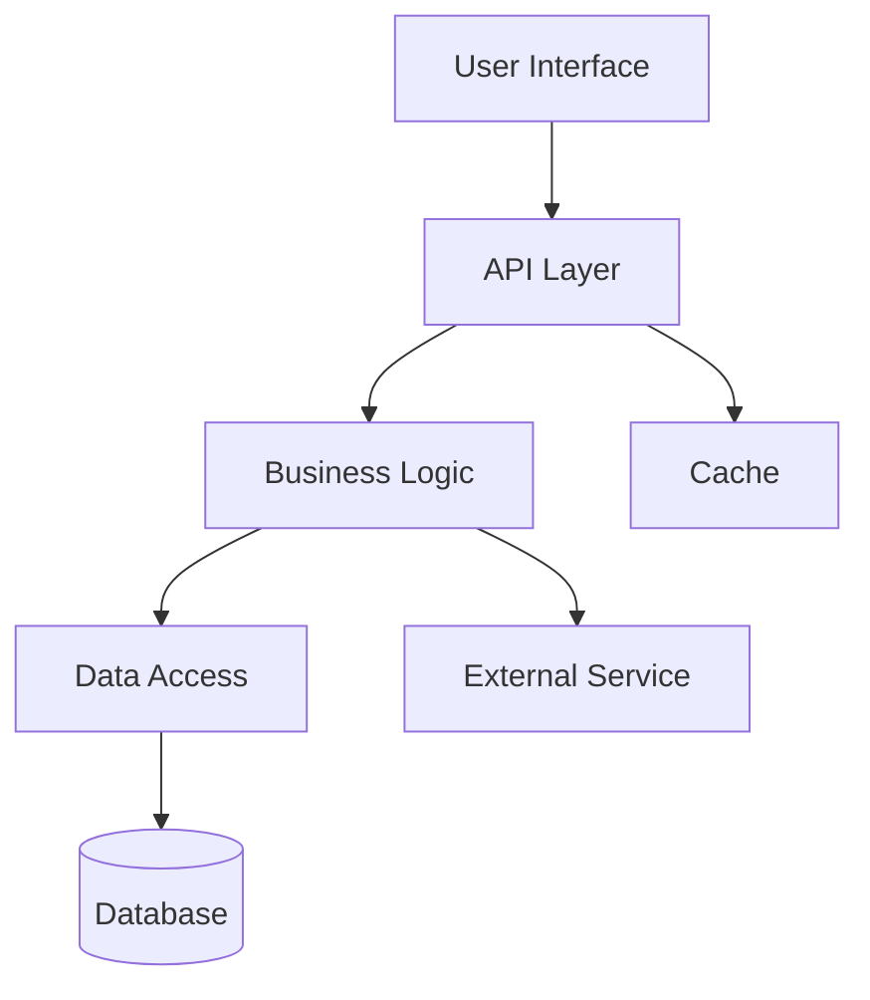
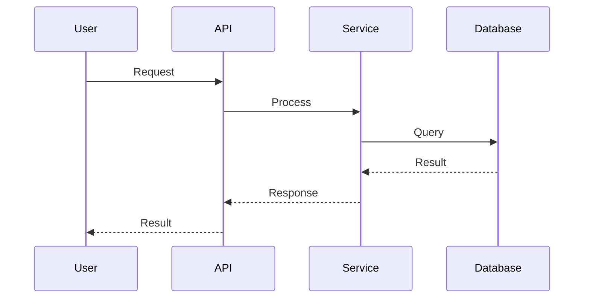

# Design Document: {feature-name}

> **Status**: DRAFT | ✅ APPROVED
> **Created**: {date}
> **Last Updated**: {date}
> **Requirements**: `.claude/specs/{feature-name}/requirements.md`

## Overview

{High-level description of the feature and how it fits into the overall system architecture. What components are involved? How does data flow?}

---

## Steering Document Alignment

### Technical Standards (tech.md)
{How does this design follow the patterns and conventions documented in tech.md?}

- **Architecture Pattern**: {e.g., follows MVC pattern per tech.md}
- **Coding Standards**: {e.g., uses TypeScript strict mode}
- **Testing Standards**: {e.g., 80% coverage requirement}

### Project Structure (structure.md)
{How does this implementation follow the file organization in structure.md?}

- **File Location**: {where new files will be placed}
- **Naming Conventions**: {how files/components will be named}
- **Module Organization**: {how code will be organized}

---

## Code Reuse Analysis

### Existing Components to Leverage

| Component | Location | Usage |
|-----------|----------|-------|
| {Component 1} | `path/to/component` | {How it will be used} |
| {Component 2} | `path/to/utility` | {How it will be extended} |
| {Component 3} | `path/to/service` | {How it will be integrated} |

### Integration Points

| Existing System | Integration Method | Notes |
|-----------------|-------------------|-------|
| {System 1} | {API/Event/Direct} | {Integration details} |
| {System 2} | {API/Event/Direct} | {Integration details} |

---

## Architecture

{Overall architecture description}



### Architecture Decisions

| Decision | Options Considered | Choice | Rationale |
|----------|-------------------|--------|-----------|
| {Decision 1} | {Option A, Option B} | {Choice} | {Why} |
| {Decision 2} | {Option A, Option B} | {Choice} | {Why} |

---

## Components and Interfaces

### Component 1: {ComponentName}

**Purpose**: {What this component does}

**Location**: `path/to/component`

**Interfaces**:
```typescript
interface IComponentName {
  method1(param: Type): ReturnType;
  method2(param: Type): Promise<ReturnType>;
}
```

**Dependencies**:
- {Dependency 1}
- {Dependency 2}

**Reuses**:
- {Existing utility or component}

### Component 2: {ComponentName}

**Purpose**: {What this component does}

**Location**: `path/to/component`

**Interfaces**:
```typescript
interface IComponentName {
  // Interface definition
}
```

---

## Data Models

### Model 1: {ModelName}

```typescript
interface ModelName {
  id: string;
  name: string;
  createdAt: Date;
  updatedAt: Date;
  // Additional properties
}
```

**Storage**: {Database table, collection, or storage location}

**Relationships**:
- {Relationship to other models}

### Model 2: {ModelName}

```typescript
interface ModelName {
  // Model definition
}
```

---

## API Design

### Endpoint 1: {Method} {Path}

**Purpose**: {What this endpoint does}

**Request**:
```json
{
  "field1": "value",
  "field2": 123
}
```

**Response**:
```json
{
  "id": "abc123",
  "status": "success",
  "data": {}
}
```

**Error Responses**:
- `400`: Invalid input
- `401`: Unauthorized
- `404`: Resource not found
- `500`: Internal server error

### Endpoint 2: {Method} {Path}

{Similar structure}

---

## Error Handling

### Error Scenarios

| Scenario | Handling Strategy | User Impact |
|----------|------------------|-------------|
| {Scenario 1} | {How to handle} | {What user sees} |
| {Scenario 2} | {How to handle} | {What user sees} |
| {Scenario 3} | {How to handle} | {What user sees} |

### Error Codes

| Code | Message | Recovery Action |
|------|---------|-----------------|
| {ERR001} | {Message} | {What to do} |
| {ERR002} | {Message} | {What to do} |

---

## Security Considerations

### Authentication
{How users are authenticated for this feature}

### Authorization
{What permissions are required, how they are checked}

### Data Protection
{How sensitive data is protected}

### Input Validation
{How user input is validated and sanitized}

---

## Performance Considerations

### Expected Load
- {Concurrent users}
- {Requests per second}
- {Data volume}

### Optimization Strategies
- {Caching strategy}
- {Query optimization}
- {Lazy loading}

### Performance Targets
- {Response time targets}
- {Throughput targets}

---

## Testing Strategy

### Unit Testing
{Unit testing approach and key components to test}

**Coverage Target**: {percentage}

**Key Test Cases**:
- {Test case 1}
- {Test case 2}

### Integration Testing
{Integration testing approach and key flows to test}

**Key Integration Tests**:
- {Integration test 1}
- {Integration test 2}

### End-to-End Testing
{E2E testing approach and user scenarios to test}

**Key E2E Scenarios**:
- {Scenario 1}
- {Scenario 2}

---

## Deployment Considerations

### Environment Requirements
- {Requirement 1}
- {Requirement 2}

### Configuration
- {Config item 1}
- {Config item 2}

### Migration Steps
1. {Step 1}
2. {Step 2}

### Rollback Plan
{How to rollback if issues occur}

---

## Sequence Diagrams

### Main Flow



---

## Open Technical Questions

- [ ] {Question 1}
- [ ] {Question 2}
- [ ] {Question 3}

---

## Approval

| Role | Name | Date | Signature |
|------|------|------|-----------|
| Tech Lead | | | |
| Architect | | | |
| Security | | | |

---

*Generated by /scw:spec-create - SuperClaude Spec Workflow*
