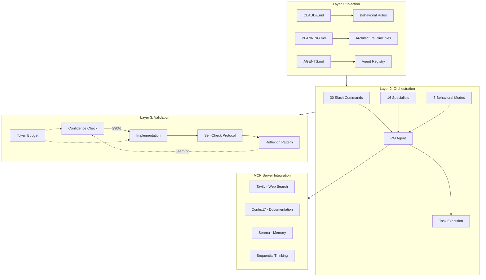
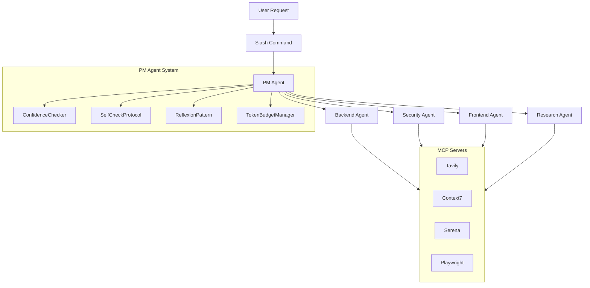
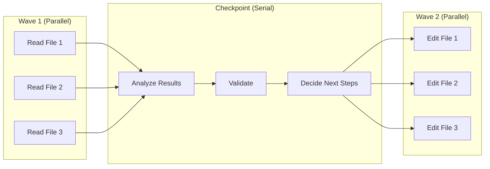

# SuperClaude Framework - Comprehensive Analysis Report

> **Version**: 4.1.9
> **Repository**: https://github.com/SuperClaude-Org/SuperClaude_Framework
> **License**: MIT
> **Analysis Date**: 2025-01-28

---

## Table of Contents

1. [Executive Summary](#1-executive-summary)
2. [Problem Statement](#2-problem-statement)
3. [Architecture Overview](#3-architecture-overview)
4. [Core Components Deep Dive](#4-core-components-deep-dive)
5. [Critical Files Reference](#5-critical-files-reference)
6. [Architecture Patterns](#6-architecture-patterns)
7. [Usage Workflow Examples](#7-usage-workflow-examples)
8. [Performance Metrics](#8-performance-metrics)
9. [Future Roadmap](#9-future-roadmap)

---

## 1. Executive Summary

### What is SuperClaude Framework?

SuperClaude Framework is a **meta-programming configuration framework** that transforms Claude Code (Anthropic's AI IDE) into a structured, systematic development platform. It operates as a "system prompt operating system" - treating Claude Code behavioral configuration as a programmable, extensible platform.

### Distribution Channels

| Channel | Package | Command |
|---------|---------|---------|
| **PyPI** | `superclaude` | `pip install superclaude` or `pipx install superclaude` |
| **NPM** | `@bifrost_inc/superclaude` | `npm install @bifrost_inc/superclaude` |
| **GitHub** | Direct clone | `git clone https://github.com/SuperClaude-Org/SuperClaude_Framework.git` |

### Key Statistics

| Component | Count | Description |
|-----------|-------|-------------|
| **Slash Commands** | 30 | Complete development lifecycle coverage |
| **Specialized Agents** | 16 | Domain experts (PM, Security, Backend, Frontend, etc.) |
| **Behavioral Modes** | 7 | Adaptive contexts (Brainstorming, Research, Token-Efficiency) |
| **MCP Integrations** | 8 | Enhanced capabilities (Tavily, Context7, Serena, etc.) |
| **Python LOC** | ~3,897 | Core implementation |

### Core Value Proposition

SuperClaude provides:
- **Pre-execution confidence checking** - Prevents wrong-direction work
- **Post-implementation validation** - Catches 94% of hallucinations
- **Parallel execution patterns** - 3.5x speedup
- **Token-efficient workflows** - 30-50% context savings
- **Cross-session learning** - Continuous improvement via Reflexion

---

## 2. Problem Statement

### The Five Critical Challenges in AI-Assisted Development

SuperClaude addresses five fundamental problems that plague AI-assisted development:

| # | Problem | Impact | SuperClaude Solution |
|---|---------|--------|---------------------|
| 1 | **Wrong-direction work** | Wastes 5,000-50,000 tokens per incident | Confidence checking BEFORE implementation |
| 2 | **Hallucination risk** | Undetected errors in production | Evidence-based self-check protocol |
| 3 | **Inefficient execution** | Sequential operations are slow | Wave→Checkpoint→Wave parallel pattern |
| 4 | **Poor token allocation** | Complex tasks get same budget as simple | Complexity-based token budgeting |
| 5 | **Lost context** | Same mistakes repeated across sessions | Reflexion pattern with cross-session learning |

### ROI Analysis

```
Wrong-Direction Prevention ROI:
├── Confidence check cost: ~200 tokens
├── Prevented wrong work: 5,000-50,000 tokens
└── ROI: 25x - 250x per incident
```

---

## 3. Architecture Overview

### 3-Layer System Architecture

SuperClaude operates through three distinct layers:

#### ASCII Diagram

```
┌─────────────────────────────────────────────────────────────────────────┐
│                        SUPERCLAUDE FRAMEWORK                             │
├─────────────────────────────────────────────────────────────────────────┤
│                                                                          │
│  ┌────────────────────────────────────────────────────────────────┐     │
│  │                    LAYER 1: INJECTION                          │     │
│  │  CLAUDE.md → Behavioral rules injected at session start        │     │
│  │  PLANNING.md → Architecture principles and constraints         │     │
│  │  AGENTS.md → Agent registry and workflow coordination          │     │
│  └────────────────────────────────────────────────────────────────┘     │
│                                    ↓                                     │
│  ┌────────────────────────────────────────────────────────────────┐     │
│  │                  LAYER 2: ORCHESTRATION                        │     │
│  │                                                                 │     │
│  │  ┌──────────────┐  ┌──────────────┐  ┌──────────────┐         │     │
│  │  │ 30 Commands  │  │  16 Agents   │  │   7 Modes    │         │     │
│  │  │ /sc:*        │  │ Specialists  │  │ Behaviors    │         │     │
│  │  └──────────────┘  └──────────────┘  └──────────────┘         │     │
│  │                          ↓                                     │     │
│  │              ┌─────────────────────┐                          │     │
│  │              │     PM AGENT        │ ← Central Orchestrator   │     │
│  │              │ (Always Active)     │                          │     │
│  │              └─────────────────────┘                          │     │
│  └────────────────────────────────────────────────────────────────┘     │
│                                    ↓                                     │
│  ┌────────────────────────────────────────────────────────────────┐     │
│  │                   LAYER 3: VALIDATION                          │     │
│  │                                                                 │     │
│  │  ┌───────────┐   ┌───────────┐   ┌───────────┐   ┌──────────┐ │     │
│  │  │Confidence │ → │  Implement │ → │Self-Check │ → │Reflexion │ │     │
│  │  │  Check    │   │   (Do)     │   │ Protocol  │   │ Pattern  │ │     │
│  │  │ (≥90%)    │   │            │   │ (Verify)  │   │ (Learn)  │ │     │
│  │  └───────────┘   └───────────┘   └───────────┘   └──────────┘ │     │
│  │       ↑                                               │        │     │
│  │       └───────────────── Token Budget ────────────────┘        │     │
│  └────────────────────────────────────────────────────────────────┘     │
│                                                                          │
└─────────────────────────────────────────────────────────────────────────┘
```

#### Mermaid Diagram



### Component Relationship Map

#### ASCII Diagram

```
                                    User Request
                                         │
                                         ▼
                              ┌─────────────────────┐
                              │   Slash Command     │
                              │   (e.g., /sc:pm)    │
                              └──────────┬──────────┘
                                         │
                                         ▼
┌─────────────────────────────────────────────────────────────────────────┐
│                              PM AGENT                                    │
│  ┌─────────────────┐  ┌─────────────────┐  ┌─────────────────┐         │
│  │ ConfidenceCheck │  │ SelfCheckProto  │  │ ReflexionPat    │         │
│  │ (Pre-execution) │  │ (Post-impl)     │  │ (Learning)      │         │
│  └────────┬────────┘  └────────┬────────┘  └────────┬────────┘         │
│           │                    │                    │                   │
│           └────────────────────┴────────────────────┘                   │
│                                │                                         │
│                    ┌───────────┴───────────┐                            │
│                    │   Token Budget Mgr    │                            │
│                    │ Simple: 200 tokens    │                            │
│                    │ Medium: 1000 tokens   │                            │
│                    │ Complex: 2500 tokens  │                            │
│                    └───────────────────────┘                            │
└─────────────────────────────────────────────────────────────────────────┘
                                         │
                         ┌───────────────┼───────────────┐
                         ▼               ▼               ▼
                  ┌───────────┐   ┌───────────┐   ┌───────────┐
                  │  Agent    │   │  Agent    │   │  Agent    │
                  │ Backend   │   │ Security  │   │ Frontend  │
                  └───────────┘   └───────────┘   └───────────┘
                         │               │               │
                         └───────────────┴───────────────┘
                                         │
                                         ▼
                              ┌─────────────────────┐
                              │   MCP Servers       │
                              │ Tavily, Context7,   │
                              │ Serena, Playwright  │
                              └─────────────────────┘
```

#### Mermaid Diagram



---

## 4. Core Components Deep Dive

### 4.1 PM Agent System

The PM Agent is the central orchestrator, always active, coordinating all development workflows.

#### Location
```
src/superclaude/pm_agent/
├── __init__.py
├── confidence.py      # Pre-execution validation
├── self_check.py      # Post-implementation validation
├── reflexion.py       # Error learning patterns
└── token_budget.py    # Token allocation management
```

#### 4.1.1 ConfidenceChecker (`confidence.py`)

**Purpose**: Prevents wrong-direction work by assessing confidence BEFORE implementation.

**Decision Thresholds**:
| Confidence | Action |
|------------|--------|
| ≥ 90% | Proceed with implementation |
| 70-89% | Present alternatives to user |
| < 70% | STOP - Ask clarifying questions |

**Confidence Factors**:
```python
class ConfidenceChecker:
    """
    Assesses implementation confidence based on:
    - has_official_docs: Official documentation available?
    - has_oss_reference: Open source examples found?
    - no_duplicates: Not duplicating existing code?
    - architecture_compliant: Follows project patterns?
    - root_cause_identified: For bugs, is root cause known?
    """

    def assess(self, context: Dict) -> float:
        """Returns confidence score 0.0 - 1.0"""
        score = 0.0

        if context.get('has_official_docs'):
            score += 0.25
        if context.get('has_oss_reference'):
            score += 0.20
        if context.get('no_duplicates'):
            score += 0.20
        if context.get('architecture_compliant'):
            score += 0.20
        if context.get('root_cause_identified'):
            score += 0.15

        return min(score, 1.0)
```

**ROI Calculation**:
```
Token Savings = (Prevented Wrong Work) - (Confidence Check Cost)
             = (5,000 - 50,000 tokens) - (200 tokens)
             = 4,800 - 49,800 tokens saved

ROI = Savings / Cost = 24x - 249x
```

#### 4.1.2 SelfCheckProtocol (`self_check.py`)

**Purpose**: Validates implementation with evidence-based verification. Catches 94% of hallucinations.

**The Four Questions**:
```python
class SelfCheckProtocol:
    """
    Post-implementation validation with four critical questions:
    1. Are all tests passing?
    2. Are all requirements met?
    3. Were any assumptions made without verification?
    4. Is there evidence for every claim?
    """

    RED_FLAGS = [
        "missing_test_output",
        "vague_language",      # "should work", "probably"
        "hidden_failures",
        "no_evidence",
        "untested_edge_cases",
        "assumed_behavior",
        "incomplete_implementation"
    ]

    def validate(self, implementation: Dict) -> Tuple[bool, List[str]]:
        """Returns (passed, list_of_issues)"""
        issues = []

        if not implementation.get('test_output'):
            issues.append("missing_test_output")
        if implementation.get('has_assumptions'):
            issues.append("assumed_behavior")
        if not implementation.get('evidence_provided'):
            issues.append("no_evidence")

        return len(issues) == 0, issues
```

**Seven Red Flags**:
1. Missing test output
2. Vague language ("should work", "probably")
3. Hidden failures
4. No evidence for claims
5. Untested edge cases
6. Assumed behavior without verification
7. Incomplete implementation marked as done

#### 4.1.3 ReflexionPattern (`reflexion.py`)

**Purpose**: Cross-session learning from errors. Transforms mistakes into prevention rules.

```python
class ReflexionPattern:
    """
    Error learning and prevention:
    - Record errors with context
    - Identify patterns across sessions
    - Build prevention checklists
    - Integrate with Mindbase MCP for persistence
    """

    def record_error(self, error: Dict):
        """Record an error with full context"""
        pass

    def find_similar_errors(self, context: Dict) -> List[Dict]:
        """Find historically similar errors"""
        pass

    def generate_prevention_checklist(self, error_type: str) -> List[str]:
        """Generate checklist to prevent error type"""
        pass
```

**Workflow**:
```
Error Occurs → Record Context → Pattern Match → Update Rules → Prevent Recurrence
```

#### 4.1.4 TokenBudgetManager (`token_budget.py`)

**Purpose**: Allocates tokens based on task complexity.

**Budget Tiers**:
| Complexity | Token Budget | Use Case |
|------------|--------------|----------|
| Simple | 200 tokens | Quick fixes, small edits |
| Medium | 1,000 tokens | Standard features, refactoring |
| Complex | 2,500 tokens | Architecture changes, large features |

```python
class TokenBudgetManager:
    BUDGETS = {
        'simple': 200,
        'medium': 1000,
        'complex': 2500
    }

    def allocate(self, complexity: str) -> int:
        return self.BUDGETS.get(complexity, self.BUDGETS['medium'])

    def track_usage(self, tokens_used: int):
        """Track token consumption against budget"""
        pass
```

---

### 4.2 Execution Framework

#### Location
```
src/superclaude/execution/
├── __init__.py
├── parallel.py         # Wave→Checkpoint→Wave pattern
├── reflection.py       # Meta-reasoning
└── self_correction.py  # Error recovery
```

#### 4.2.1 Parallel Execution (`parallel.py`)

**The Wave→Checkpoint→Wave Pattern**:

```
┌─────────────────────────────────────────────────────────────────┐
│                    PARALLEL EXECUTION                           │
├─────────────────────────────────────────────────────────────────┤
│                                                                  │
│   WAVE 1 (Parallel)         CHECKPOINT         WAVE 2 (Parallel)│
│   ┌─────┐ ┌─────┐ ┌─────┐    ┌─────┐          ┌─────┐ ┌─────┐  │
│   │Read │ │Read │ │Read │ →  │Check│  →       │Edit │ │Edit │  │
│   │File1│ │File2│ │File3│    │Anal │          │File1│ │File2│  │
│   └─────┘ └─────┘ └─────┘    └─────┘          └─────┘ └─────┘  │
│                                                                  │
│   Speedup: 3.5x compared to sequential execution                 │
└─────────────────────────────────────────────────────────────────┘
```

**Example**:
```python
# Sequential (slow): 7 operations
read_file_1()  # 1
read_file_2()  # 2
read_file_3()  # 3
analyze()      # 4
edit_file_1()  # 5
edit_file_2()  # 6
edit_file_3()  # 7

# Parallel (fast): 3 waves
wave_1([read_file_1, read_file_2, read_file_3])  # 1
checkpoint(analyze)                               # 2
wave_2([edit_file_1, edit_file_2, edit_file_3])  # 3

# Speedup: 7/3 = 2.33x minimum, up to 3.5x with optimizations
```

#### 4.2.2 Reflection (`reflection.py`)

**Purpose**: Meta-reasoning about execution decisions.

```python
class ReflectionEngine:
    """
    Provides meta-cognitive capabilities:
    - Question assumptions
    - Evaluate alternative approaches
    - Assess decision quality
    """
    pass
```

#### 4.2.3 Self-Correction (`self_correction.py`)

**Purpose**: Error recovery and retry strategies.

```python
class SelfCorrection:
    """
    Error recovery mechanisms:
    - Detect failure patterns
    - Apply correction strategies
    - Retry with adjustments
    """
    pass
```

---

### 4.3 Command System (30 Commands)

All commands are invoked with `/sc:` prefix in Claude Code.

#### Command Categories

**Planning & Design (4)**:
| Command | Purpose |
|---------|---------|
| `/sc:brainstorm` | Structured requirements discovery |
| `/sc:design` | System architecture design |
| `/sc:estimate` | Development estimation |
| `/sc:spec-panel` | Multi-expert specification review |

**Development (5)**:
| Command | Purpose |
|---------|---------|
| `/sc:implement` | Feature implementation |
| `/sc:build` | Build and compile workflows |
| `/sc:improve` | Code improvements |
| `/sc:cleanup` | Refactoring and dead code removal |
| `/sc:explain` | Code explanation |

**Testing & Quality (4)**:
| Command | Purpose |
|---------|---------|
| `/sc:test` | Test generation and execution |
| `/sc:analyze` | Code analysis |
| `/sc:troubleshoot` | Debugging assistance |
| `/sc:reflect` | Retrospective analysis |

**Documentation (2)**:
| Command | Purpose |
|---------|---------|
| `/sc:document` | Documentation generation |
| `/sc:help` | Command reference |

**Version Control (1)**:
| Command | Purpose |
|---------|---------|
| `/sc:git` | Git operations |

**Project Management (3)**:
| Command | Purpose |
|---------|---------|
| `/sc:pm` | Project management (triggers PM Agent) |
| `/sc:task` | Task tracking |
| `/sc:workflow` | Workflow automation |

**Research & Analysis (2)**:
| Command | Purpose |
|---------|---------|
| `/sc:research` | Deep web research with adaptive planning |
| `/sc:business-panel` | Multi-expert business analysis |

**Utilities (9)**:
| Command | Purpose |
|---------|---------|
| `/sc:agent` | Agent selection |
| `/sc:index-repo` | Repository context optimization |
| `/sc:recommend` | Command recommendations |
| `/sc:select-tool` | Tool selection |
| `/sc:spawn` | Parallel task execution |
| `/sc:load` | Session loading |
| `/sc:save` | Session saving |
| `/sc:sc` | Show all commands |

---

### 4.4 Agent System (16 Agents)

#### Location
```
src/superclaude/agents/
├── pm-agent.md           # Project Manager (always active)
├── backend-architect.md  # Server-side architecture
├── frontend-architect.md # UI/UX architecture
├── devops-architect.md   # Infrastructure/deployment
├── security-engineer.md  # Security analysis
├── quality-engineer.md   # Testing/QA
├── performance-engineer.md # Optimization
├── python-expert.md      # Python-specific guidance
├── refactoring-expert.md # Code refactoring
├── root-cause-analyst.md # Error investigation
├── deep-research.md      # Web research
├── business-panel.md     # Business analysis
├── requirements-analyst.md # Requirements
├── learning-guide.md     # Educational guidance
├── socratic-mentor.md    # Socratic questioning
└── self-review.md        # Self-improvement
```

#### Agent Categories

**Technical Experts**:
| Agent | Domain |
|-------|--------|
| PM Agent | Project orchestration (always active) |
| Backend Architect | Server-side architecture |
| Frontend Architect | UI/UX architecture |
| DevOps Architect | Infrastructure/deployment |
| Security Engineer | Security analysis |
| Quality Engineer | Testing/QA |
| Performance Engineer | Optimization |
| Python Expert | Python-specific guidance |
| Refactoring Expert | Code refactoring patterns |
| Root Cause Analyst | Error investigation |

**Domain Experts**:
| Agent | Domain |
|-------|--------|
| Deep Research Agent | Web research |
| Business Panel | Strategic business analysis |
| Requirements Analyst | Requirements analysis |
| Learning Guide | Educational guidance |
| Socratic Mentor | Guided discovery |

---

### 4.5 Mode System (7 Modes)

#### Location
```
src/superclaude/modes/
├── MODE_Brainstorming.md     # Requirements discovery
├── MODE_Business_Panel.md    # Business analysis
├── MODE_DeepResearch.md      # Research execution
├── MODE_Introspection.md     # Self-reflection
├── MODE_Orchestration.md     # PM Agent coordination
├── MODE_Task_Management.md   # Task execution
└── MODE_Token_Efficiency.md  # Token optimization
```

#### Mode Descriptions

| Mode | Purpose | Token Impact |
|------|---------|--------------|
| **Brainstorming** | Asks right questions, explores possibilities | Standard |
| **Business Panel** | Multi-expert strategic analysis | Standard |
| **Deep Research** | Autonomous web research | High (research-heavy) |
| **Introspection** | Meta-cognitive analysis | Low |
| **Orchestration** | PM Agent coordination | Standard |
| **Task Management** | Systematic organization | Low |
| **Token-Efficiency** | 30-50% context savings | Reduced |

---

### 4.6 MCP Server Integration (8 Servers)

#### Location
```
src/superclaude/mcp/
├── MCP_Sequential.md     # Complex problem decomposition
├── MCP_Context7.md       # Official documentation
├── MCP_Tavily.md         # Real-time web research
├── MCP_Serena.md         # Session persistence
├── MCP_Morphllm.md       # Fast code editing
├── MCP_Playwright.md     # Browser automation
├── MCP_Chrome-DevTools.md # Performance analysis
└── MCP_Magic.md          # UI components
```

#### MCP Server Purposes

| Server | Purpose | Use Case |
|--------|---------|----------|
| **Sequential-Thinking** | Multi-step reasoning | Complex problem decomposition |
| **Context7** | Documentation lookup | Getting official API docs |
| **Tavily** | Web search | Real-time research |
| **Serena** | Session memory | Cross-session persistence |
| **Morphllm (Fast Apply)** | Code editing | Context-aware modifications |
| **Playwright** | Browser automation | Testing, scraping |
| **Chrome DevTools** | Performance | Profiling, analysis |
| **Magic** | UI generation | Component libraries |

---

## 5. Critical Files Reference

### 5.1 Configuration & Entry Points

| File | Location | Purpose |
|------|----------|---------|
| `pyproject.toml` | Root | Package definition, entry points, pytest markers |
| `CLAUDE.md` | Root | Behavioral instruction injection at session start |
| `PLANNING.md` | Root | Architecture principles, design rules, constraints |
| `AGENTS.md` | Root | Agent registry and workflow coordination |
| `package.json` | Root | NPM wrapper configuration |
| `Makefile` | Root | Development commands |
| `install.sh` | Root | Cross-platform installation script |

### 5.2 Python Source Modules

| Module | Location | Purpose |
|--------|----------|---------|
| `pytest_plugin.py` | `src/superclaude/` | Auto-loaded pytest entry point |
| `confidence.py` | `src/superclaude/pm_agent/` | Pre-execution confidence checking |
| `self_check.py` | `src/superclaude/pm_agent/` | Post-implementation validation |
| `reflexion.py` | `src/superclaude/pm_agent/` | Error learning patterns |
| `token_budget.py` | `src/superclaude/pm_agent/` | Token allocation management |
| `parallel.py` | `src/superclaude/execution/` | Wave→Checkpoint→Wave pattern |
| `reflection.py` | `src/superclaude/execution/` | Meta-reasoning |
| `self_correction.py` | `src/superclaude/execution/` | Error recovery |
| `main.py` | `src/superclaude/cli/` | CLI entry point |
| `install_commands.py` | `src/superclaude/cli/` | Command installation |
| `doctor.py` | `src/superclaude/cli/` | Health check diagnostics |

### 5.3 Markdown-Based Definitions

| Directory | Contents | Count |
|-----------|----------|-------|
| `src/superclaude/commands/` | Slash command definitions | 30 |
| `src/superclaude/agents/` | Agent persona definitions | 16 |
| `src/superclaude/modes/` | Behavioral mode definitions | 7 |
| `src/superclaude/mcp/` | MCP server configurations | 8 |
| `src/superclaude/core/` | Core rules (RULES.md, PRINCIPLES.md, FLAGS.md) | 3+ |

### 5.4 Test Files

| File | Location | Purpose |
|------|----------|---------|
| `test_confidence.py` | `tests/unit/` | ConfidenceChecker tests |
| `test_self_check.py` | `tests/unit/` | SelfCheckProtocol tests |
| `test_reflexion.py` | `tests/unit/` | ReflexionPattern tests |
| `test_token_budget.py` | `tests/unit/` | TokenBudgetManager tests |
| `test_cli_install.py` | `tests/unit/` | CLI installation tests |
| `test_pytest_plugin.py` | `tests/integration/` | Plugin integration tests |
| `conftest.py` | `tests/` | Pytest configuration |

---

## 6. Architecture Patterns

### 6.1 Behavioral Injection Pattern

**What**: Inject behavioral rules at session start via markdown files.

**How**: CLAUDE.md is read when Claude Code session starts, injecting:
- Development environment rules (use `uv` not `pip`)
- Workflow guidelines
- Architecture principles
- MCP tool selection guidance

```
Session Start → Read CLAUDE.md → Inject Rules → Constrained Behavior
```

### 6.2 Markdown-as-Configuration Pattern

**What**: Define commands, agents, and modes as human-readable markdown files.

**Benefits**:
- Human-readable and editable
- Version-controllable
- Easily extendable
- No compilation required

**Structure**:
```markdown
# Command/Agent Name

## Metadata
- name: command-name
- description: What it does
- mcp-servers: [list, of, servers]

## Instructions
Detailed behavioral instructions...
```

### 6.3 Wave→Checkpoint→Wave Pattern

**What**: Execute operations in parallel waves with checkpoints for validation.

#### ASCII Diagram

```
┌─────────────────────────────────────────────────────────────────┐
│                    WAVE-CHECKPOINT-WAVE                         │
├─────────────────────────────────────────────────────────────────┤
│                                                                  │
│   WAVE 1                  CHECKPOINT              WAVE 2        │
│   ┌─────────────────┐    ┌───────────────┐    ┌──────────────┐ │
│   │ ┌───┐ ┌───┐    │    │               │    │ ┌───┐ ┌───┐  │ │
│   │ │Op1│ │Op2│ ...│ →  │   Validate    │ →  │ │Op1│ │Op2│  │ │
│   │ └───┘ └───┘    │    │   Decide      │    │ └───┘ └───┘  │ │
│   │   Parallel     │    │   Adjust      │    │   Parallel   │ │
│   └─────────────────┘    └───────────────┘    └──────────────┘ │
│                                                                  │
│   Time: T1                Time: T2             Time: T3         │
│   (Parallel)              (Serial)             (Parallel)       │
│                                                                  │
│   Speedup: 3.5x compared to fully sequential                    │
└─────────────────────────────────────────────────────────────────┘
```

#### Mermaid Diagram



### 6.4 Evidence-Based Validation (PDCA Cycle)

**What**: Plan-Do-Check-Act cycle with evidence requirements.

```
┌──────────────────────────────────────────────────────────────┐
│                      PDCA CYCLE                               │
├──────────────────────────────────────────────────────────────┤
│                                                               │
│   ┌───────────┐      ┌───────────┐                           │
│   │   PLAN    │ ───▶ │    DO     │                           │
│   │Confidence │      │Implement  │                           │
│   │  Check    │      │with Budget│                           │
│   └───────────┘      └─────┬─────┘                           │
│         ▲                  │                                  │
│         │                  ▼                                  │
│   ┌─────┴─────┐      ┌───────────┐                           │
│   │   ACT     │ ◀─── │   CHECK   │                           │
│   │ Reflexion │      │Self-Check │                           │
│   │  Pattern  │      │ Protocol  │                           │
│   └───────────┘      └───────────┘                           │
│                                                               │
└──────────────────────────────────────────────────────────────┘
```

### 6.5 Plugin Auto-Discovery Pattern

**What**: Pytest automatically discovers and loads the plugin.

**How**: Entry point in `pyproject.toml`:
```toml
[project.entry-points.pytest11]
superclaude = "superclaude.pytest_plugin"
```

**Flow**:
```
pip install superclaude → Entry point registered →
pytest runs → Discovers entry point → Loads pytest_plugin.py →
Fixtures available → Markers registered
```

### 6.6 Command Distribution Pattern

**What**: Three-stage deployment for commands.

```
┌─────────────────┐     ┌─────────────────┐     ┌─────────────────┐
│    plugins/     │ ──▶ │      src/       │ ──▶ │   ~/.claude/    │
│   (Source of    │     │ (Distribution   │     │   (User's       │
│    Truth)       │     │     Copy)       │     │  Claude Code)   │
└─────────────────┘     └─────────────────┘     └─────────────────┘
         │                      │                       │
    Development            Package Build          Installation
    (Edit here)           (Sync to src/)        (superclaude install)
```

---

## 7. Usage Workflow Examples

### 7.1 Installation

```bash
# Option 1: From PyPI (recommended)
pipx install superclaude
superclaude install

# Option 2: From source
git clone https://github.com/SuperClaude-Org/SuperClaude_Framework.git
cd SuperClaude_Framework
./install.sh

# Option 3: Development mode
make dev  # Uses UV for editable install

# Install MCP servers (optional)
superclaude mcp --list
superclaude mcp --servers tavily context7 serena
```

### 7.2 Basic Usage in Claude Code

```
# View available commands
/sc:help

# Start project management
/sc:pm

# Research a topic
/sc:research "latest React best practices"

# Implement a feature
/sc:implement "add JWT authentication"

# Analyze code quality
/sc:analyze "./src" --focus security

# Generate documentation
/sc:document "./src/api"
```

### 7.3 Pytest Integration

```python
import pytest

# Fixtures are auto-injected via plugin
def test_with_confidence(confidence_checker):
    """Test with confidence checking"""
    context = {
        'has_official_docs': True,
        'architecture_compliant': True,
        'no_duplicates': True
    }

    confidence = confidence_checker.assess(context)
    assert confidence >= 0.7

@pytest.mark.confidence_check
def test_feature(confidence_checker):
    """Marked test with confidence requirement"""
    pass

@pytest.mark.self_check
def test_implementation(self_check_protocol):
    """Test with self-check validation"""
    implementation = {
        'test_output': 'All tests pass',
        'evidence_provided': True
    }

    passed, issues = self_check_protocol.validate(implementation)
    assert passed

@pytest.mark.complexity("complex")
def test_complex_feature(token_budget):
    """Test with complex token budget (2500 tokens)"""
    budget = token_budget.allocate('complex')
    assert budget == 2500
```

### 7.4 Pre-Implementation Workflow

```python
# 1. Check confidence before implementing
context = {
    'has_official_docs': True,     # Found official React docs
    'has_oss_reference': True,     # Found similar OSS examples
    'no_duplicates': True,         # Verified no existing implementation
    'architecture_compliant': True, # Follows project patterns
    'root_cause_identified': False  # N/A for new feature
}

confidence = confidence_checker.assess(context)

if confidence >= 0.9:
    print("Proceed with implementation")
elif confidence >= 0.7:
    print("Present alternatives to user")
else:
    print("STOP - Ask clarifying questions")
```

### 7.5 Post-Implementation Workflow

```python
# 2. Validate after implementing
implementation = {
    'test_output': """
        PASSED test_auth_login
        PASSED test_auth_logout
        PASSED test_auth_refresh
    """,
    'requirements_met': ['R1', 'R2', 'R3'],
    'has_assumptions': False,
    'evidence_provided': True
}

passed, issues = self_check_protocol.validate(implementation)

if passed:
    print("Implementation verified!")
else:
    print(f"Issues found: {issues}")
    # Address issues before marking complete
```

---

## 8. Performance Metrics

### 8.1 Quantified Benefits

| Metric | Value | Source |
|--------|-------|--------|
| **Parallel Execution Speedup** | 3.5x | Wave→Checkpoint→Wave pattern |
| **Token Savings (Token-Efficiency Mode)** | 30-50% | Optimized context usage |
| **Hallucination Detection Rate** | 94% | Self-Check Protocol |
| **Wrong-Direction Prevention ROI** | 25x-250x | Confidence checking |
| **MCP Server Performance Boost** | 2-3x | Combined integrations |

### 8.2 Token Budget ROI

```
┌─────────────────────────────────────────────────────────────────┐
│                    TOKEN BUDGET ROI                             │
├─────────────────────────────────────────────────────────────────┤
│                                                                  │
│  Confidence Check Cost: ~200 tokens                             │
│                                                                  │
│  Scenario: Wrong direction prevented                            │
│  ├── Simple task saved: 5,000 tokens → ROI: 25x                │
│  ├── Medium task saved: 15,000 tokens → ROI: 75x               │
│  └── Complex task saved: 50,000 tokens → ROI: 250x             │
│                                                                  │
│  Break-even: Prevent wrong direction 1 in 25 times             │
│                                                                  │
└─────────────────────────────────────────────────────────────────┘
```

### 8.3 Execution Time Comparison

| Operation | Sequential | Parallel (Wave) | Speedup |
|-----------|------------|-----------------|---------|
| Read 5 files | 5 ops | 1 wave | 5x |
| Analyze + decide | 1 op | 1 checkpoint | 1x |
| Edit 5 files | 5 ops | 1 wave | 5x |
| **Total** | 11 ops | 3 operations | **3.67x** |

---

## 9. Future Roadmap

### 9.1 Version 5.0 Plans

**TypeScript Plugin System**:
- `.claude-plugin/` directory auto-detection
- Project-local plugin discovery
- Plugin marketplace distribution
- Enhanced type safety

**Enhanced MCP Integration**:
- Mindbase MCP for cross-session memory
- Deeper Serena integration
- Custom MCP server support

**Plugin Manifest Format**:
```json
{
  "name": "custom-plugin",
  "version": "1.0.0",
  "entry": "./index.ts",
  "agents": ["./agents/*.md"],
  "commands": ["./commands/*.md"],
  "hooks": ["./hooks/*.ts"]
}
```

### 9.2 Planned Features

| Feature | Status | Target Version |
|---------|--------|----------------|
| TypeScript plugin system | Planned | v5.0 |
| Plugin marketplace | Planned | v5.0 |
| Mindbase MCP integration | In progress | v4.2 |
| Enhanced reflexion persistence | Planned | v4.2 |
| Visual workflow editor | Concept | v6.0 |

---

## Appendix A: Quick Reference

### Command Cheatsheet

```bash
# Installation
pipx install superclaude
superclaude install
superclaude doctor  # Health check

# Common Commands
/sc:pm              # Project management
/sc:research "..."  # Deep research
/sc:implement "..." # Feature implementation
/sc:analyze ./src   # Code analysis
/sc:test            # Run tests
/sc:git             # Git operations

# MCP Servers
superclaude mcp --list
superclaude mcp --servers tavily context7
```

### Pytest Markers

```python
@pytest.mark.confidence_check  # Pre-execution validation
@pytest.mark.self_check        # Post-implementation validation
@pytest.mark.reflexion         # Error learning
@pytest.mark.complexity("simple"|"medium"|"complex")  # Token budget
@pytest.mark.unit              # Unit test
@pytest.mark.integration       # Integration test
```

### Confidence Thresholds

| Score | Action |
|-------|--------|
| ≥ 90% | Proceed |
| 70-89% | Present alternatives |
| < 70% | Stop, ask questions |

---

## Appendix B: Glossary

| Term | Definition |
|------|------------|
| **PM Agent** | Project Manager Agent - central orchestrator, always active |
| **Confidence Checker** | Pre-execution validation ensuring readiness |
| **Self-Check Protocol** | Post-implementation evidence-based validation |
| **Reflexion Pattern** | Cross-session error learning mechanism |
| **Token Budget** | Complexity-based token allocation |
| **Wave→Checkpoint→Wave** | Parallel execution pattern with validation |
| **MCP** | Model Context Protocol - external capability integration |
| **PDCA** | Plan-Do-Check-Act continuous improvement cycle |

---

*Report generated with deep analysis using sequential-thinking MCP server*
*SuperClaude Framework v4.1.9*
