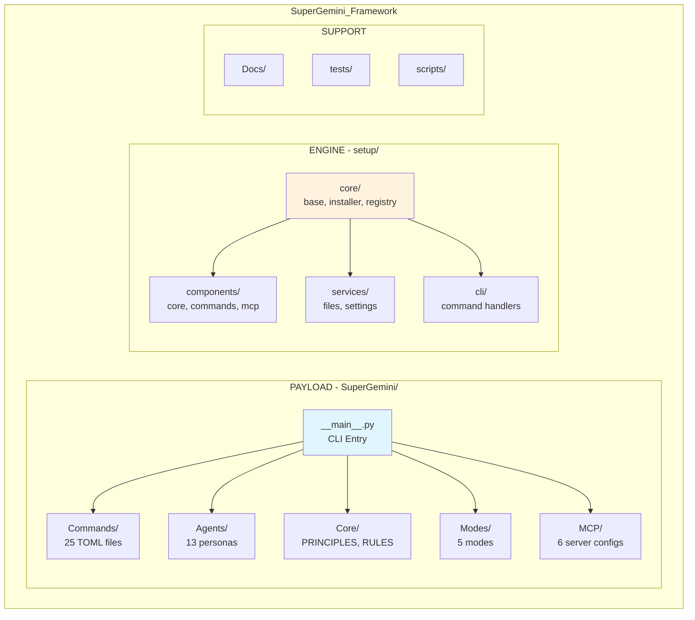
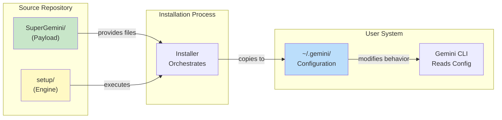
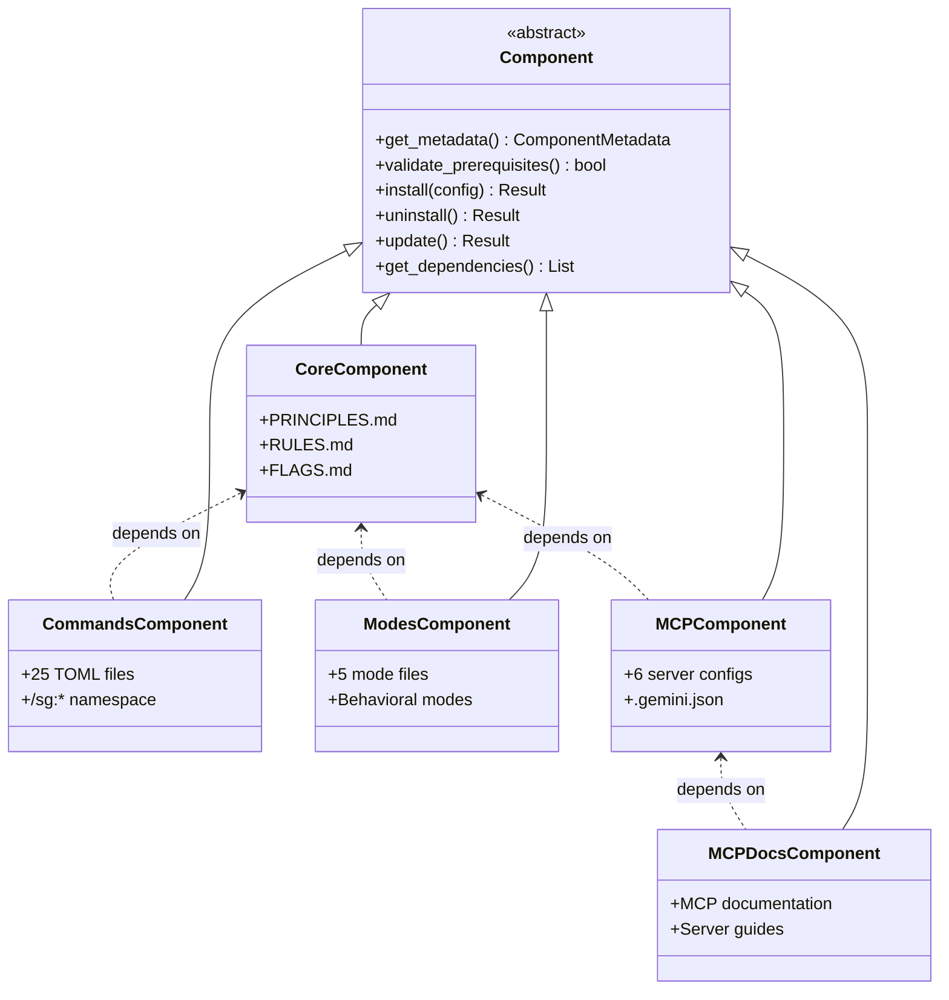
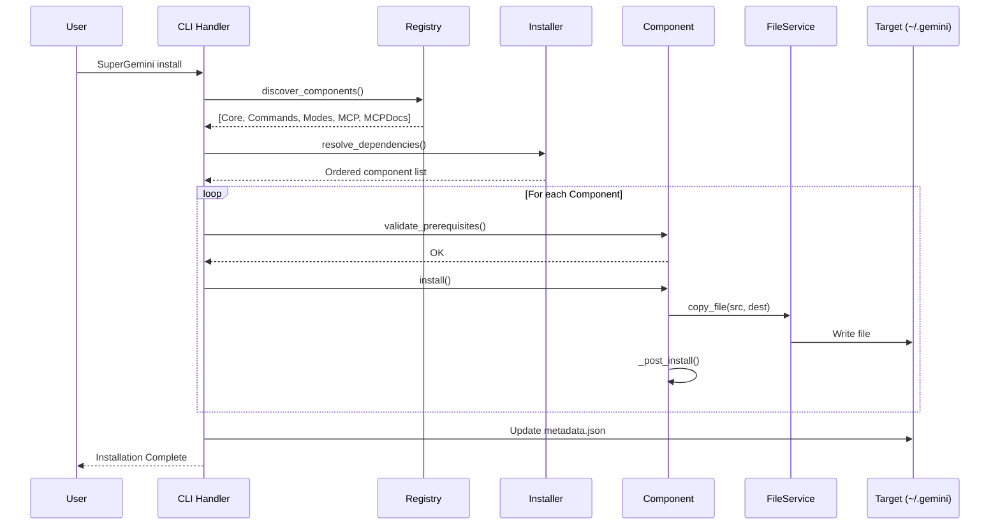
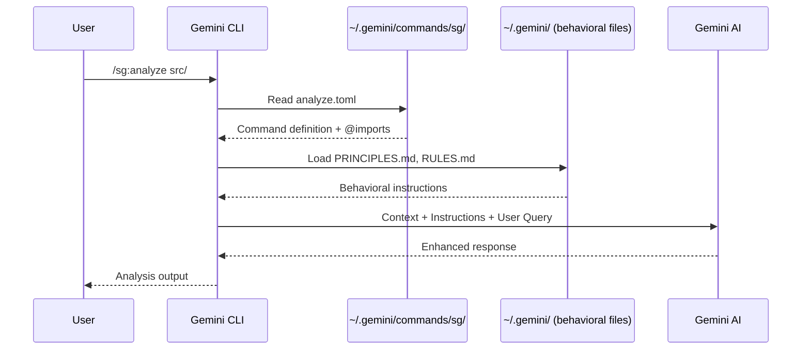
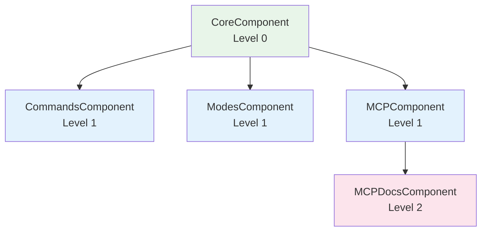

# SuperGemini Framework - Comprehensive Analysis Report

> **Analysis Date**: November 28, 2025
> **Version Analyzed**: 4.2.1
> **Analysis Focus**: Architecture & Quality (Deep)
> **Report Format**: Technical Documentation with Diagrams

---

## Table of Contents

1. [Executive Summary](#1-executive-summary)
2. [Project Overview](#2-project-overview)
3. [Architecture Deep Dive](#3-architecture-deep-dive)
4. [Core Functionality Analysis](#4-core-functionality-analysis)
5. [Critical Files Reference](#5-critical-files-reference)
6. [Quality Assessment](#6-quality-assessment)
7. [Technical Specifications](#7-technical-specifications)
8. [Conclusion & Recommendations](#8-conclusion--recommendations)

---

## 1. Executive Summary

### What Is SuperGemini?

**SuperGemini v4.2.1** is a **Meta-Programming Configuration Framework** that enhances Google's Gemini CLI through behavioral instruction injection.

### Key Architectural Insight

> **Critical Understanding**: SuperGemini is NOT a traditional Python application that executes code at runtime. Instead, it is a **configuration distribution system** that installs behavioral files to `~/.gemini/` which modify how Gemini CLI operates.

### Core Value Proposition

| Capability | Description |
|------------|-------------|
| **25+ Slash Commands** | TOML-based command definitions (`/sg:analyze`, `/sg:implement`, etc.) |
| **13 AI Agent Personas** | Specialized behavioral instructions for different roles |
| **5 Operational Modes** | Context-aware behavior modifications |
| **6 MCP Integrations** | External tool coordination (context7, playwright, etc.) |

### Project Identity

- **Organization**: SuperClaude-Org
- **License**: MIT
- **Repository**: https://github.com/SuperClaude-Org/SuperGemini_Framework
- **Package Names**: `SuperGemini`, `supergemini`, `sg`

---

## 2. Project Overview

### 2.1 Installation Methods

| Method | Command | Recommended |
|--------|---------|-------------|
| **pipx** | `pipx install SuperGemini` | Yes (isolated environment) |
| **pip** | `pip install SuperGemini` | Alternative |
| **npm** | `npm install -g @superclaude-org/supergemini` | Node.js wrapper |

### 2.2 Target Installation Location

All configuration files are installed to:
```
~/.gemini/
├── PRINCIPLES.md          # Core behavioral principles
├── RULES.md               # Behavioral constraints
├── FLAGS.md               # Command flag definitions
├── metadata.json          # Component registration
├── commands/sg/           # 25+ slash command definitions
├── .gemini.json           # MCP server configurations
└── backups/               # Version backups
```

### 2.3 Directory Structure Overview

#### ASCII Diagram

```
SuperGemini_Framework/
│
├── SuperGemini/              ← PAYLOAD (What Gets Installed)
│   ├── __main__.py           │  CLI entry point
│   ├── version.py            │  Version management
│   ├── Commands/             │  25 TOML command files
│   ├── Agents/               │  13 agent persona files
│   ├── Core/                 │  Behavioral rules (PRINCIPLES, RULES, FLAGS)
│   ├── Modes/                │  5 operational modes
│   ├── MCP/                  │  MCP server configurations
│   └── Config/               │  Configuration files
│
├── setup/                    ← ENGINE (How Installation Works)
│   ├── __main__.py           │  Setup entry point
│   ├── core/                 │  Base classes, installer, registry
│   ├── components/           │  Component installers (core, commands, mcp)
│   ├── services/             │  Shared services (files, settings, config)
│   ├── cli/                  │  CLI command handlers
│   └── utils/                │  Utilities (logger, security, UI)
│
├── Docs/                     ← DOCUMENTATION
│   ├── Getting-Started/      │  Installation guides
│   ├── User-Guide/           │  Commands, agents, modes reference
│   ├── Developer-Guide/      │  Architecture, contributing
│   └── Reference/            │  Examples, troubleshooting
│
├── tests/                    ← TEST SUITE
├── scripts/                  ← BUILD & PUBLISH SCRIPTS
├── bin/                      ← NPM BOOTSTRAP SCRIPTS
│
└── Configuration Files
    ├── pyproject.toml        │  Python package config
    ├── setup.py              │  Legacy setup
    ├── package.json          │  NPM wrapper config
    ├── VERSION               │  Single source of truth (4.2.1)
    └── CLAUDE.md             │  Claude Code development guide
```

#### Mermaid Diagram



---

## 3. Architecture Deep Dive

### 3.1 Dual Directory System

The framework employs a **Dual Directory Architecture** that cleanly separates concerns:

#### ASCII Diagram - Dual Directory Concept

```
┌─────────────────────────────────────────────────────────────────┐
│                    DUAL DIRECTORY SYSTEM                         │
├─────────────────────────────┬───────────────────────────────────┤
│       SuperGemini/          │           setup/                   │
│       (PAYLOAD)             │          (ENGINE)                  │
├─────────────────────────────┼───────────────────────────────────┤
│ • TOML command definitions  │ • Python installation code        │
│ • Markdown agent personas   │ • Component orchestration         │
│ • JSON MCP configurations   │ • File operations                 │
│ • Behavioral instruction    │ • Validation & security           │
│   files                     │ • CLI interface                   │
├─────────────────────────────┼───────────────────────────────────┤
│ COPIED TO ~/.gemini/        │ EXECUTED DURING INSTALL           │
│ at installation time        │ then discarded                    │
└─────────────────────────────┴───────────────────────────────────┘
```

#### Mermaid Diagram - Dual Directory Flow



### 3.2 Component-Based Architecture

All installable items extend an abstract `Component` base class:

#### ASCII Diagram - Component Hierarchy

```
                    ┌─────────────────────┐
                    │   Component (ABC)   │
                    │  setup/core/base.py │
                    └──────────┬──────────┘
                               │
           ┌───────────────────┼───────────────────┐
           │                   │                   │
           ▼                   ▼                   ▼
┌──────────────────┐ ┌──────────────────┐ ┌──────────────────┐
│  CoreComponent   │ │CommandsComponent │ │  MCPComponent    │
│   (core.py)      │ │  (commands.py)   │ │    (mcp.py)      │
└──────────────────┘ └──────────────────┘ └──────────────────┘
           │                   │                   │
           ▼                   ▼                   ▼
┌──────────────────┐ ┌──────────────────┐ ┌──────────────────┐
│  ModesComponent  │ │ MCPDocsComponent │ │  [Future...]     │
│   (modes.py)     │ │  (mcp_docs.py)   │ │                  │
└──────────────────┘ └──────────────────┘ └──────────────────┘

Abstract Methods:
├── get_metadata()           → Component identity
├── validate_prerequisites() → Pre-flight checks
├── _install(config)         → Installation logic
├── _post_install()          → Post-installation tasks
├── uninstall()              → Cleanup logic
└── get_dependencies()       → Dependency declaration
```

#### Mermaid Diagram - Component Architecture



### 3.3 Design Patterns Used

| Pattern | Implementation | Location |
|---------|----------------|----------|
| **Abstract Factory** | `Component` base class defines interface | `setup/core/base.py` |
| **Registry** | Auto-discovery of components | `setup/core/registry.py` |
| **Service Layer** | Shared services for operations | `setup/services/` |
| **Strategy** | Different install strategies per component | `setup/components/` |
| **Dependency Injection** | Installer manages component lifecycle | `setup/core/installer.py` |
| **Template Method** | `install()` calls `_install()` + `_post_install()` | `setup/core/base.py` |

### 3.4 Data Flow Architecture

#### Installation Pipeline - ASCII

```
┌──────────────────────────────────────────────────────────────────────┐
│                      INSTALLATION PIPELINE                            │
└──────────────────────────────────────────────────────────────────────┘

User Input                ComponentRegistry              Installer
    │                           │                           │
    │  SuperGemini install      │                           │
    │ ─────────────────────────>│                           │
    │                           │  discover_components()    │
    │                           │ ─────────────────────────>│
    │                           │                           │
    │                           │  resolve_dependencies()   │
    │                           │ ─────────────────────────>│
    │                           │                           │
    │                           │     For Each Component:   │
    │                           │     ┌─────────────────────┤
    │                           │     │ validate_prerequisites()
    │                           │     │ get_files_to_install()
    │                           │     │ FileService.copy_file()
    │                           │     │ _post_install()
    │                           │     └─────────────────────┤
    │                           │                           │
    │                           │  Update metadata.json     │
    │                           │ <─────────────────────────│
    │  Installation Complete    │                           │
    │ <─────────────────────────│                           │
```

#### Installation Pipeline - Mermaid



#### Command Execution Flow - ASCII

```
┌──────────────────────────────────────────────────────────────────────┐
│                    COMMAND EXECUTION FLOW                             │
│                   (After Installation)                                │
└──────────────────────────────────────────────────────────────────────┘

User                    Gemini CLI              ~/.gemini/
  │                         │                       │
  │  /sg:analyze src/       │                       │
  │ ───────────────────────>│                       │
  │                         │  Read analyze.toml    │
  │                         │ ─────────────────────>│
  │                         │                       │
  │                         │  Parse @imports       │
  │                         │ ─────────────────────>│
  │                         │  (PRINCIPLES.md,      │
  │                         │   RULES.md, etc.)     │
  │                         │                       │
  │                         │<──────────────────────│
  │                         │  Inject instructions  │
  │                         │  into context         │
  │                         │                       │
  │  Enhanced AI Response   │                       │
  │ <───────────────────────│                       │
```

#### Command Execution Flow - Mermaid



### 3.5 Component Dependency Graph

#### ASCII Diagram

```
                    DEPENDENCY RESOLUTION ORDER

Level 0:            ┌─────────────────┐
(No deps)           │  CoreComponent  │
                    └────────┬────────┘
                             │
         ┌───────────────────┼───────────────────┐
         │                   │                   │
         ▼                   ▼                   ▼
Level 1: ┌──────────┐  ┌──────────┐  ┌──────────┐
         │Commands  │  │  Modes   │  │   MCP    │
         └──────────┘  └──────────┘  └────┬─────┘
                                          │
                                          ▼
Level 2:                           ┌──────────┐
                                   │ MCP Docs │
                                   └──────────┘
```

#### Mermaid Diagram



---

## 4. Core Functionality Analysis

### 4.1 Commands System

**Location**: `SuperGemini_Framework/SuperGemini/Commands/`
**Format**: TOML configuration files
**Namespace**: `/sg:*` in Gemini CLI

| Command | File | Purpose |
|---------|------|---------|
| `/sg:analyze` | `analyze.toml` | Code quality, security, performance analysis |
| `/sg:implement` | `implement.toml` | Feature implementation workflow |
| `/sg:design` | `design.toml` | Architecture design |
| `/sg:test` | `test.toml` | Testing workflow |
| `/sg:build` | `build.toml` | Build process management |
| `/sg:document` | `document.toml` | Documentation generation |
| `/sg:git` | `git.toml` | Git operations |
| `/sg:save` | `save.toml` | Session state persistence |
| `/sg:load` | `load.toml` | Session recovery |
| `/sg:brainstorm` | `brainstorm.toml` | Requirements discovery |
| `/sg:improve` | `improve.toml` | Code improvements |
| `/sg:troubleshoot` | `troubleshoot.toml` | Problem diagnosis |
| `/sg:research` | `research.toml` | Web research |
| `/sg:explain` | `explain.toml` | Code explanation |
| `/sg:estimate` | `estimate.toml` | Project estimation |
| `/sg:cleanup` | `cleanup.toml` | Code cleanup |
| `/sg:workflow` | `workflow.toml` | Workflow generation |
| `/sg:spawn` | `spawn.toml` | Task spawning |
| `/sg:reflect` | `reflect.toml` | Task reflection |
| `/sg:index` | `index.toml` | Repository indexing |
| `/sg:select-tool` | `select-tool.toml` | Tool selection |
| `/sg:spec-panel` | `spec-panel.toml` | Multi-expert specification review |
| `/sg:business-panel` | `business-panel.toml` | Business perspective analysis |

### 4.2 Agent System

**Location**: `SuperGemini_Framework/SuperGemini/Agents/`
**Format**: Markdown behavioral instruction files
**Activation**: Keyword triggers, file types, complexity scoring, explicit mention

| Agent | File | Specialization |
|-------|------|----------------|
| **System Architect** | `system-architect.md` | High-level system design, scalability |
| **Backend Architect** | `backend-architect.md` | API & database design |
| **Frontend Architect** | `frontend-architect.md` | UI/UX architecture |
| **Security Engineer** | `security-engineer.md` | Security & compliance (veto authority) |
| **Python Expert** | `python-expert.md` | Python-specific expertise |
| **DevOps Architect** | `devops-architect.md` | Infrastructure & deployment |
| **Performance Engineer** | `performance-engineer.md` | Optimization specialist |
| **Quality Engineer** | `quality-engineer.md` | Testing & validation |
| **Refactoring Expert** | `refactoring-expert.md` | Code quality improvement |
| **Root Cause Analyst** | `root-cause-analyst.md` | Problem diagnosis |
| **Requirements Analyst** | `requirements-analyst.md` | Requirements discovery |
| **Technical Writer** | `technical-writer.md` | Documentation specialist |
| **Learning Guide** | `learning-guide.md` | Educational guidance |

#### Agent Coordination Pattern

```
┌─────────────────────────────────────────────────────────────────┐
│                    AGENT COORDINATION                            │
├─────────────────────────────────────────────────────────────────┤
│                                                                  │
│  ┌─────────────────────────────────────────────────────────┐    │
│  │              SYSTEM ARCHITECT (Strategic Lead)           │    │
│  │              Coordinates multi-domain decisions          │    │
│  └─────────────────────────────────────────────────────────┘    │
│                              │                                   │
│          ┌───────────────────┼───────────────────┐              │
│          ▼                   ▼                   ▼              │
│  ┌───────────────┐  ┌───────────────┐  ┌───────────────┐       │
│  │   Backend     │  │   Frontend    │  │    DevOps     │       │
│  │   Architect   │  │   Architect   │  │   Architect   │       │
│  └───────────────┘  └───────────────┘  └───────────────┘       │
│                              │                                   │
│                              ▼                                   │
│  ┌─────────────────────────────────────────────────────────┐    │
│  │           SECURITY ENGINEER (Veto Authority)             │    │
│  │           Validates all decisions before finalization    │    │
│  └─────────────────────────────────────────────────────────┘    │
│                                                                  │
└─────────────────────────────────────────────────────────────────┘
```

### 4.3 Modes System

**Location**: `SuperGemini_Framework/SuperGemini/Modes/`
**Format**: Markdown behavioral instruction files

| Mode | File | Behavior Modification |
|------|------|----------------------|
| **Brainstorming** | `MODE_Brainstorming.md` | Socratic dialogue, creative ideation |
| **Introspection** | `MODE_Introspection.md` | Self-reflection, validation |
| **Orchestration** | `MODE_Orchestration.md` | Multi-agent coordination |
| **Task Management** | `MODE_Task_Management.md` | Task lifecycle management |
| **Token Efficiency** | `MODE_Token_Efficiency.md` | Context-aware optimization |

### 4.4 MCP Integration

**Location**: `SuperGemini_Framework/SuperGemini/MCP/`
**Format**: JSON configuration + Markdown documentation

| Server | Package | Purpose |
|--------|---------|---------|
| **context7** | `@upstash/context7-mcp` | Official library documentation |
| **sequential** | `@modelcontextprotocol/server-sequential-thinking` | Multi-step reasoning |
| **magic** | `@21st-dev/magic` | UI component generation |
| **playwright** | `@playwright/mcp` | Browser automation & testing |
| **morphllm** | `@morph-llm/morph-fast-apply` | Fast Apply code transformation |
| **serena** | `git+https://github.com/oraios/serena` | Semantic code analysis |

---

## 5. Critical Files Reference

### 5.1 Architecture-Critical Files

| Category | Relative Path | Purpose |
|----------|---------------|---------|
| **CLI Entry** | `SuperGemini/__main__.py` | Command dispatcher, routes to setup components |
| **Component ABC** | `setup/core/base.py` | Abstract base class defining component contract |
| **Orchestrator** | `setup/core/installer.py` | Main installation coordinator |
| **Discovery** | `setup/core/registry.py` | Component auto-discovery and registration |
| **Validator** | `setup/core/validator.py` | Installation validation |

### 5.2 Component Implementations

| Category | Relative Path | Purpose |
|----------|---------------|---------|
| **Core Component** | `setup/components/core.py` | Installs PRINCIPLES.md, RULES.md, FLAGS.md |
| **Commands Component** | `setup/components/commands.py` | Installs 25 TOML command files |
| **Modes Component** | `setup/components/modes.py` | Installs 5 behavioral mode files |
| **MCP Component** | `setup/components/mcp.py` | Installs MCP server configurations |
| **MCP Docs Component** | `setup/components/mcp_docs.py` | Installs MCP documentation |

### 5.3 Service Layer

| Category | Relative Path | Purpose |
|----------|---------------|---------|
| **File Operations** | `setup/services/files.py` | Cross-platform file copy, move, remove |
| **Settings Management** | `setup/services/settings.py` | Metadata and settings persistence |
| **Config Service** | `setup/services/config.py` | Configuration management |
| **GEMINI.md Service** | `setup/services/gemini_md.py` | GEMINI.md import management |

### 5.4 Configuration Files

| Category | Relative Path | Purpose |
|----------|---------------|---------|
| **Package Config** | `pyproject.toml` | Python package metadata, build config |
| **Version** | `VERSION` | Single source of truth (4.2.1) |
| **Legacy Setup** | `setup.py` | Legacy setup.py configuration |
| **NPM Config** | `package.json` | NPM wrapper configuration |

### 5.5 Behavioral Core Files

| Category | Relative Path | Purpose |
|----------|---------------|---------|
| **Principles** | `SuperGemini/Core/PRINCIPLES.md` | Core software engineering philosophy |
| **Rules** | `SuperGemini/Core/RULES.md` | Behavioral rules and constraints |
| **Flags** | `SuperGemini/Core/FLAGS.md` | Command flag definitions |
| **Research Config** | `SuperGemini/Core/RESEARCH_CONFIG.md` | Web research configuration |

### 5.6 Utility Files

| Category | Relative Path | Purpose |
|----------|---------------|---------|
| **Logger** | `setup/utils/logger.py` | Logging configuration |
| **Security** | `setup/utils/security.py` | Path validation, permission checks |
| **UI** | `setup/utils/ui.py` | Terminal UI (colors, headers, prompts) |
| **Paths** | `setup/utils/paths.py` | Path utilities |
| **Environment** | `setup/utils/environment.py` | Environment detection |

---

## 6. Quality Assessment

### 6.1 Strengths

#### Architecture Quality
| Aspect | Rating | Evidence |
|--------|--------|----------|
| **Separation of Concerns** | Excellent | Clean Payload/Engine split |
| **Modularity** | Excellent | Component-based, independently installable |
| **Extensibility** | Good | Easy to add new components/commands |
| **Documentation** | Excellent | 20+ files in Docs/ directory |

#### Code Quality
| Aspect | Rating | Evidence |
|--------|--------|----------|
| **Abstraction** | Excellent | Well-defined Component interface |
| **Security** | Good | Path validation, permission checks |
| **Cross-Platform** | Good | Windows/Linux/macOS support |
| **Error Handling** | Good | Graceful failures, backup/rollback |

#### Developer Experience
| Aspect | Rating | Evidence |
|--------|--------|----------|
| **Installation** | Excellent | Multiple methods (pipx, pip, npm) |
| **CLI** | Good | Multiple aliases (SuperGemini, sg) |
| **Backup/Restore** | Good | Built-in backup capability |
| **Dry-Run Mode** | Good | Safe testing before installation |

### 6.2 Areas for Improvement

| Area | Current State | Recommendation |
|------|---------------|----------------|
| **Test Coverage** | Limited (1 test file) | Add comprehensive unit/integration tests |
| **Code Duplication** | Some potential in components | Extract shared logic to base class |
| **Documentation Size** | Large monolithic files | Split into focused modules |
| **Type Hints** | Partial coverage | Add complete type annotations |

### 6.3 Architecture Quality Score

```
┌─────────────────────────────────────────────────────────────────┐
│                    ARCHITECTURE QUALITY SCORE                    │
├─────────────────────────────────────────────────────────────────┤
│                                                                  │
│  Category                    Score    Weight    Weighted         │
│  ─────────────────────────────────────────────────────────       │
│  Separation of Concerns      9/10     0.20      1.80             │
│  Modularity                  9/10     0.20      1.80             │
│  Code Quality                8/10     0.15      1.20             │
│  Documentation               9/10     0.15      1.35             │
│  Security                    8/10     0.10      0.80             │
│  Extensibility               8/10     0.10      0.80             │
│  Test Coverage               5/10     0.10      0.50             │
│  ─────────────────────────────────────────────────────────       │
│                                                                  │
│  OVERALL SCORE:              8.25/10                             │
│  RATING:                     EXCELLENT                           │
│                                                                  │
└─────────────────────────────────────────────────────────────────┘
```

---

## 7. Technical Specifications

### 7.1 Python Support

| Version | Status |
|---------|--------|
| Python 3.8 | Supported (requires `importlib-metadata`) |
| Python 3.9 | Supported |
| Python 3.10 | Supported |
| Python 3.11 | Supported |
| Python 3.12 | Supported |

### 7.2 Dependencies

#### Required
| Package | Version | Purpose |
|---------|---------|---------|
| `setuptools` | ≥45.0.0 | Package installation |
| `importlib-metadata` | ≥1.0.0 | Python 3.8 compatibility |

#### Optional (Development)
| Package | Version | Purpose |
|---------|---------|---------|
| `pytest` | ≥6.0 | Testing |
| `pytest-cov` | ≥2.0 | Coverage |
| `black` | ≥22.0 | Code formatting |
| `flake8` | ≥4.0 | Linting |
| `mypy` | ≥0.900 | Type checking |

### 7.3 Platform Compatibility

| Platform | Status | Notes |
|----------|--------|-------|
| **macOS** | Full Support | Primary development platform |
| **Linux** | Full Support | All distributions |
| **Windows** | Full Support | Cross-platform file operations |

### 7.4 External Requirements

| Requirement | Purpose | Required |
|-------------|---------|----------|
| **Node.js** | MCP server installation | Optional (for MCP) |
| **npm/yarn** | Package management | Optional (for MCP) |
| **Git** | Version control | Optional |

---

## 8. Conclusion & Recommendations

### 8.1 Summary

SuperGemini Framework is a **well-architected meta-programming configuration system** that enhances Gemini CLI through behavioral instruction injection. Its dual directory architecture cleanly separates installation concerns from configuration payload, and its component-based design enables modular, maintainable code.

### 8.2 Key Architectural Insights

1. **Configuration Over Code**: The framework distributes behavior through `.md` and `.toml` files, not runtime code execution
2. **Persona Mode**: Agents enhance Gemini CLI through instruction injection, not as separate processes
3. **Component Independence**: Each component can be installed/uninstalled independently
4. **Security First**: Path validation, permission checking, and backup capabilities are built-in

### 8.3 Recommendations for Users

| Recommendation | Priority | Rationale |
|----------------|----------|-----------|
| Use `pipx install` | High | Isolated environment prevents conflicts |
| Start with `--profile standard` | Medium | Good balance of features |
| Enable MCP servers | Medium | Unlocks external tool integration |
| Read `CLAUDE.md` | Low | Understanding development patterns |

### 8.4 Recommendations for Developers

| Recommendation | Priority | Rationale |
|----------------|----------|-----------|
| Add comprehensive tests | High | Current coverage is limited |
| Complete type annotations | Medium | Improves IDE support and catches bugs |
| Split large documentation | Low | Improves maintainability |
| Add CI/CD pipeline | Medium | Automates quality checks |

### 8.5 Future Considerations

- **Plugin System**: Allow third-party component development
- **Version Migration**: Automated upgrade paths between versions
- **Health Monitoring**: Dashboard for component status
- **Cloud Sync**: Optional configuration synchronization

---

## Appendix A: File Count Summary

| Directory | Files | Lines (Est.) |
|-----------|-------|--------------|
| `SuperGemini/Commands/` | 25 | ~2,500 |
| `SuperGemini/Agents/` | 13 | ~1,500 |
| `SuperGemini/Core/` | 7 | ~1,400 |
| `SuperGemini/Modes/` | 5 | ~500 |
| `SuperGemini/MCP/` | 12 | ~800 |
| `setup/` | 20+ | ~3,000 |
| `Docs/` | 20+ | ~5,000 |
| **Total** | **100+** | **~15,000** |

---

## Appendix B: Glossary

| Term | Definition |
|------|------------|
| **Payload** | Configuration files that get installed to `~/.gemini/` |
| **Engine** | Python code that performs the installation |
| **Component** | An installable unit (core, commands, modes, mcp) |
| **Persona Mode** | AI behavior modification through instruction injection |
| **MCP** | Model Context Protocol - external tool integration |
| **SSOT** | Single Source of Truth (VERSION file) |

---

*Report generated by Claude Code Analysis*
*Analysis methodology: Multi-agent exploration + Sequential thinking deep analysis*
